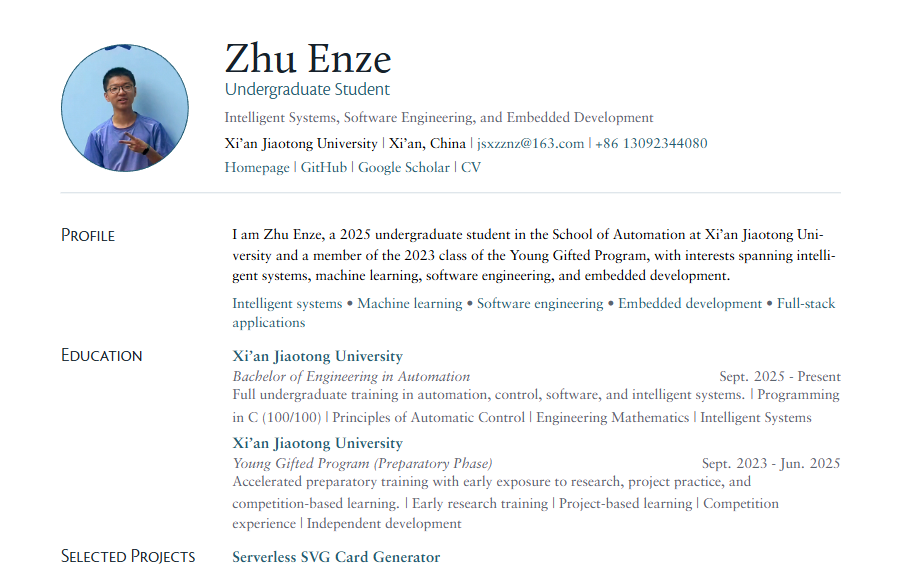

# QuarkCV - A Data-Driven XeLaTeX Resume Template

EN / [简体中文](README_cn.md)

A polished, data-driven XeLaTeX resume template that turns structured YAML into a clean, modern, link-rich PDF.



Built for people who want the visual quality of LaTeX, the maintainability of structured data, and the flexibility to evolve a resume without rewriting template code every time a project changes.

## Why This Template Feels Different

- Data first. Your resume content lives in `Data/*.yml`, not scattered across TeX blocks.
- Resume-aware selection. Rich homepage-style data can coexist with concise resume-specific fields such as `resume_title`, `resume_summary`, and `resume_highlights`.
- Clickable everywhere. Email, phone, homepage, school links, project links, publication links, and local files are generated as clickable PDF links.
- Elegant layout. The template uses custom typography, tighter hierarchy, softer colors, a profile header with avatar support, and cleaner section alignment than typical academic-resume boilerplate.
- Built to scale. Add more projects, awards, or publications without turning the main TeX file into a maintenance nightmare.
- Safe fallbacks. Avatar download is cached locally, with an automatic placeholder if the image is unavailable.

## How It Works

1. Edit the data files in `Data/`.
2. Run `python scripts/build_resume_data.py`.
3. The script generates `main.tex` directly.
4. Compile `main.tex` with XeLaTeX.

The result is a workflow where `main.tex` is a generated artifact and `Data/*.yml` is the source of truth.

## Project Structure

```
QuarkCV/
├─ Data/
│  ├─ _config.yml
│  ├─ profile.yml
│  ├─ education.yml
│  ├─ project.yml
│  ├─ awards.yml
│  ├─ publications.yml
│  └─ resume-avatar.jpg        # cached automatically when possible
├─ Fonts/
├─ scripts/
│  └─ build_resume_data.py
├─ myresume.sty
├─ main.tex                    # generated by the script
└─ Readme.md
```

## Quick Start

### 1. Edit your data

Update the YAML files in `Data/`:

- `Data/_config.yml`: identity, theme, links, visibility flags, preview counts, avatar
- `Data/profile.yml`: summary, focus areas, skills
- `Data/education.yml`: education entries and compact resume highlights
- `Data/project.yml`: project entries, resume titles, and resume summaries
- `Data/awards.yml`: awards and reasons
- `Data/publications.yml`: publications and links

### 2. Generate `main.tex`

```bash
python scripts/build_resume_data.py
```

### 3. Compile the PDF

```bash
xelatex main.tex
```

If you prefer a clean final build, run XeLaTeX twice.

## Data Design Philosophy

This template intentionally separates rich archival data from resume-facing data.

For example, a project can have:

- `title`: the full original project name
- `description`: a long-form description suitable for a homepage
- `resume_title`: the shorter title you want on the resume
- `resume_summary`: the compact statement you want recruiters to read first

That means you can keep detailed records for your personal site while still producing a focused, high-signal one-page or short-form resume.

The same idea is used in:

- `profile.yml` with `resume_summary` and `resume_focus`
- `education.yml` with `resume_summary` and `resume_highlights`
- `project.yml` with `resume_title` and `resume_summary`

## Configuration Highlights

In `Data/_config.yml`, you can control:

- `theme.accent_color`
- `theme.accent_soft_color`
- `section_visibility`
- `list_preview_count`
- `contact_links`
- `avatar`

This gives you a clean way to retheme the template or adjust density without touching layout logic.

## Clickable Links

The generated PDF supports clickable links for:

- email
- phone
- homepage
- GitHub
- Google Scholar
- CV link
- school / institution links
- project links
- publication links
- local files such as PDFs

## Avatar Support

Set `avatar` in `Data/_config.yml` to:

- a remote image URL
- a local relative path
- or leave it empty

When a remote URL is provided, the generator attempts to cache it locally as `Data/resume-avatar.*`. If that fails, the template falls back to a clean initials-based placeholder instead of breaking compilation.

## Designed For

- students building their first serious technical resume
- researchers who want a cleaner academic CV starter
- engineers with many projects and evolving experience
- anyone who wants a beautiful LaTeX resume without editing raw TeX every time content changes

## Customization Ideas

- switch the accent colors in `_config.yml`
- increase or reduce project / award preview counts
- add a publications section by toggling `section_visibility.publications`
- adapt the YAML schema for internships, services, talks, or open-source contributions
- tune spacing and typography in `myresume.sty` if you want a denser or more editorial look

## Recommended Workflow

- treat `Data/*.yml` as your content source
- treat `scripts/build_resume_data.py` as your content-to-layout bridge
- treat `main.tex` as generated output
- treat `myresume.sty` as the visual system

That separation keeps the project pleasant to maintain even after the resume grows.

## Notes

- Use XeLaTeX for compilation.
- `main.tex` is generated automatically, so manual edits there will be overwritten.
- If your avatar or local linked files move, regenerate before compiling again.

## License

Use, adapt, and remix freely for personal resumes, portfolio resumes, and academic CV variants.

If you turn this into your own public template, keeping attribution is appreciated.
